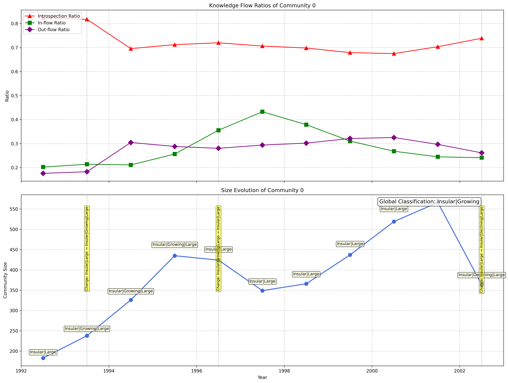
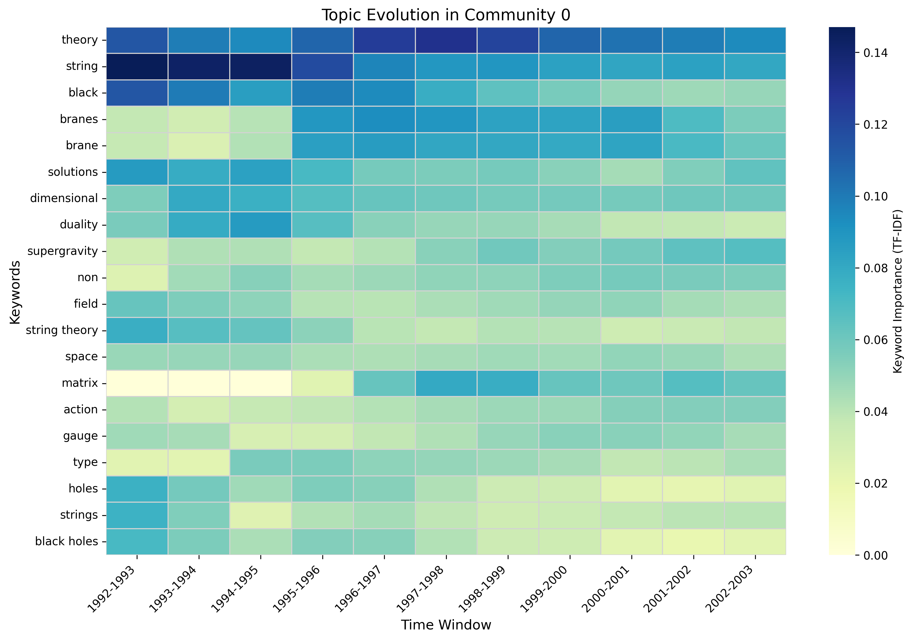
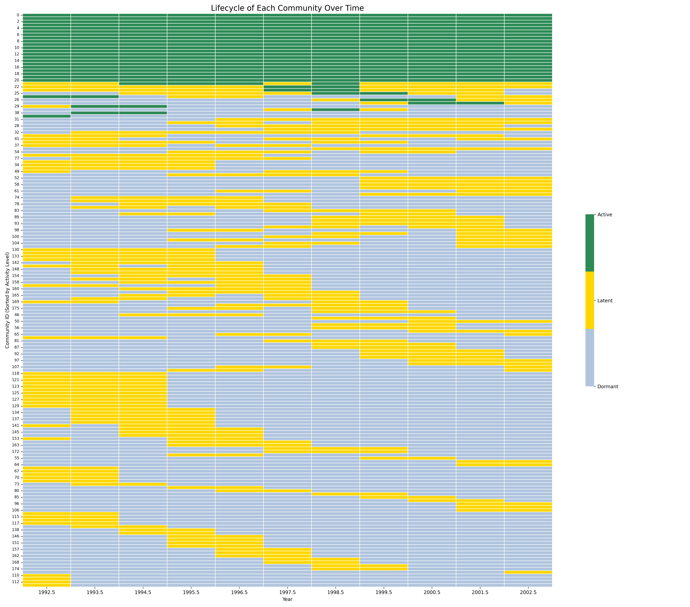

# 科学社区演化分析

一个用于检测、跟踪和解释引文网络中科学研究社区演化过程的模块化 Python 分析流程。

该项目起源于我在 University of Galway 的硕士论文。我独立完成了从原始引文数据和论文元数据，到网络构建、社区检测、时间演化分析、主题建模、社区分类和可视化的完整分析流程。

[English](README.md) | **简体中文**

## 项目内容

该项目将原始引文数据转化为一个端到端的科学社区演化分析流程：

```text
引文数据 + 论文元数据
          ↓
       数据清洗
          ↓
      构建引文网络
          ↓
   Leiden 社区检测
          ↓
    TF-IDF + LDA 主题建模
          ↓
  COIN 风格引文流动指标
          ↓
      2 年滑动窗口
          ↓
 社区生命周期 / 增长分析
          ↓
 知识流动与桥接社区分析
          ↓
      CSV + 可视化报告
```

分析对象为 1992–2003 年的 arXiv High-Energy Physics Theory（Hep-Th）引文网络，研究不同科研社区如何增长、衰退、趋于封闭、交换知识，以及研究主题如何随时间发生变化。

## 项目体现的能力

这个仓库不仅展示研究结果，也展示完整的数据分析与工程实现能力。

- **Python 数据处理** —— 读取、清洗、对齐和转换引文与论文元数据
- **ETL 风格流程设计** —— 从原始数据到分析数据集和最终输出的结构化处理流程
- **图与网络分析** —— 有向引文网络、Leiden 社区检测、跨社区引文流分析
- **NLP / 主题建模** —— TF-IDF 特征提取和基于 LDA 的主题分析
- **时间序列分析** —— 滑动窗口指标、增长率、生命周期跟踪和长期趋势分类
- **数据可视化** —— 网络图、热力图、增长曲线、生命周期图和时间演化图
- **软件工程组织** —— 模块化源码、可复用函数、统一流程入口、依赖管理和异常处理

## 核心分析模块

### 社区检测

项目基于引文网络进行 Leiden 社区检测，计算不同社区规模，并进一步筛选主要科研社区进行后续分析。

### 主题建模

对于主要社区，使用论文标题和摘要进行 TF-IDF 处理，并通过 LDA 提取代表性主题关键词，为纯结构性的社区划分补充语义解释。

### 时间演化分析

项目通过 **2 年滑动窗口** 跟踪社区演化，并使用 COIN 风格的引文流动指标，包括：

- **Introspection** —— 社区内部引用比例
- **Inflow** —— 从其他社区接收到的引用
- **Outflow** —— 指向其他社区的引用
- **Influence score** —— 结合活跃社区规模与引文流入计算影响力

同时根据状态和变化趋势对社区进行分类，包括 Active、Latent、Dormant、Growing、Declining、Hub、Exporter、Insular、Stagnating 和 Opening 等模式。

### 跨社区知识流动

项目构建社区之间的知识流动矩阵，用于识别：

- 桥接社区
- 知识枢纽
- 新兴社区
- 新活跃社区的主要知识来源
- 不同时间阶段的跨社区知识流变化

## 示例结果

### 社区演化



展示不同时间窗口中的引文流动比例、社区规模以及社区分类变化。

### 主题演化



展示单个社区中的主要研究关键词如何随时间变化。

### 社区生命周期



展示不同社区在 Dormant、Latent 和 Active 状态之间的变化过程。

## 项目结构

```text
.
├── main.py                     # 端到端分析流程入口
├── requirements.txt            # Python 依赖
├── data.py                     # 保留的原始论文实现，供参考
├── src/
│   ├── data_loading.py         # 引文 / 元数据读取与清洗
│   ├── community_analysis.py   # Leiden、主题建模、跨社区流分析
│   ├── temporal_analysis.py    # COIN 指标、滑动窗口、社区分类
│   ├── extended_analysis.py    # 生命周期、社区角色、新兴和桥接分析
│   └── visualization.py        # 可复用可视化函数
└── results/                    # 生成的图表和 CSV 分析结果
```

仓库中保留了原始硕士论文脚本作为参考实现，同时提供了模块化版本，将数据处理、社区分析、时间逻辑和可视化拆分为更易维护和复用的组件。

## 生成结果

项目会输出可进一步处理的 CSV 文件，以及适合展示的可视化结果，例如：

```text
network_statistics.png
paper_temporal_distribution.png
community_size_distribution.png
community_network.png
community_<id>_evolution.png
community_<id>_topic_evolution.png
core_roles_over_time.png
growth_patterns.png
community_macro_trends.png
knowledge_flow_clustermap.png
community_state_distribution.png
community_lifecycle_heatmap.png
final_knowledge_flow.png

community_evolution.csv
growth_patterns.csv
bridge_communities.csv
emerging_communities.csv   # 检测到新兴社区时生成
```

## 技术栈

**Python · Pandas · NumPy · NetworkX · igraph · leidenalg · scikit-learn · Matplotlib · Seaborn**

## 本地运行

安装依赖：

```bash
pip install -r requirements.txt
```

将 Hep-Th 引文文件和摘要数据放到：

```text
data/
├── cit-HepTh.txt
└── cit-HepTh-abstracts/
```

然后运行：

```bash
python main.py
```

生成的分析文件会写入 `results/` 目录。

## 项目背景

该项目最初作为硕士研究项目完成，但其实现过程也体现了一套可迁移到其他数据和软件任务中的完整工作流：读取原始数据、构建处理流程、应用分析方法、生成可复用结果，并将整体代码组织为可维护的模块化结构。
